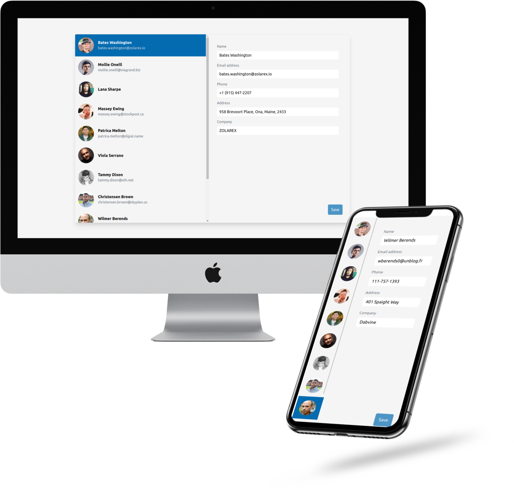
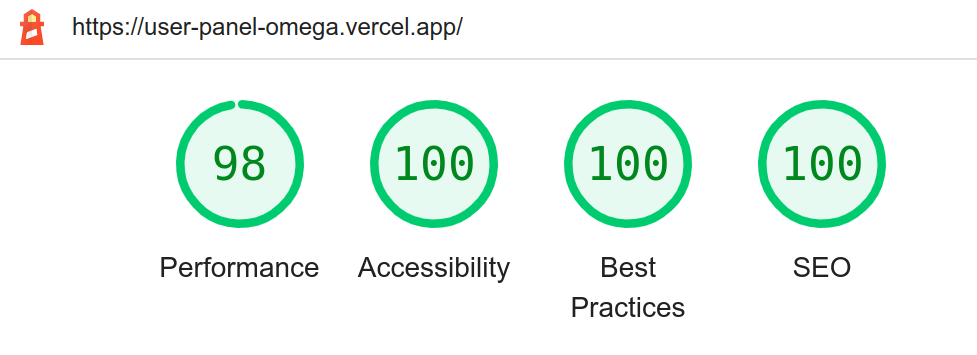

## User panel application 💻

The admin panel consists of 2 horizontal panels. At the left panel you have a list of users.
Each list item contains a photo along with their name and their email (if we have this
data). At the right panel you have a form to edit the data of a selected user.

### Running the app :star:

The app is deployed on https://user-panel-omega.vercel.app/
If you want to run it locally, clone the repo and run:
```
npm install
npm start
```



### User stories :point_left:

- Load all the users at the left panel. 
- When you click on a user (left panel):
  * The right panel should display the corresponding user's data within a form.
- When you edit a user's data:
  * The Save button should be enabled
  * The Cancel button should appear
- When you click Save:
  * Make an HTTP PUT request with the new user data to the appropriate
endpoint
  * Cancel button should disappear
  * Save button should be disabled
- When you click Cancel:
  * The form fields should reset to its previous saved data (state)
  * Cancel button should disappear
  * Save button should be disabled

### Notes :speech_balloon:


 **Tech Used** :
  1. Typescript
  2. Tailwind CSS
  3. React Hooks

### Accessibility :innocent:

+ Added content only for screen readers
+ Made users focusable in order for screen readers to be able to read.

### Performance :rocket:

- Lazy loading user images
- Caching HTTP request.


